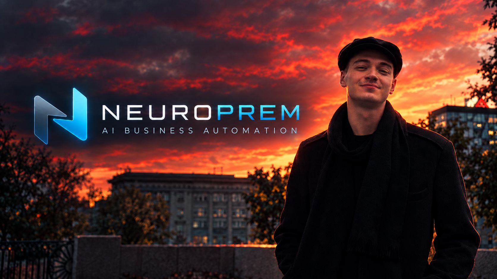

# Yuri Pocepaev

**LLM Engineer · Lead Developer at [Neuroprem](https://neuroprem.com)**

I work on LLM quantization, efficient inference, retrieval and memory for agentic systems. I share practical runtime fixes, reproducible benchmarks, and lessons from experiments—including their limitations.

**Less hype. More engineering.**

### Projects

- **[NVFP4 QSA](https://github.com/badbat4560/nvfp4-qsa)** — KV-cache kernels, hybrid vLLM cache accounting, and paired BF16/NVFP4 measurements.
- **[Qwen Flash runtime notes](https://github.com/badbat4560/qwen-flash-runtime-notes)** — PLE loading, FlashInfer B12x compatibility patches, tests, and deployment notes.
- **[GLiClass FP8 W8A8](https://huggingface.co/badbat4560/gliclass-multilang-ultra-fp8w8a8)** — multilingual zero-shot classification with a Triton and CUDA Graph inference adapter, evaluated on an RTX 4050 Laptop.

### Engineering notes

- [Running Qwen Flash-Next NVFP4 in vLLM: PLE Loading, B12x Fixes, and Stable Inference](https://badbat4560.hashnode.dev/running-qwen-flash-next-nvfp4-in-vllm-ple-loading-b12x-fixes-and-stable-inference)
- [Building an NVFP4 KV Cache for a Hybrid Qwen Model](https://badbat4560.hashnode.dev/building-an-nvfp4-kv-cache-for-a-hybrid-qwen-model)
- [How I Took GLiClass FP8 from 59 ms to 16 ms on an RTX 4050](https://badbat4560.hashnode.dev/how-i-took-gliclass-fp8-from-59-ms-to-16-ms-on-an-rtx-4050)

### Find me

[Hugging Face](https://huggingface.co/badbat4560) · [Hashnode](https://badbat4560.hashnode.dev) · [DEV](https://dev.to/badbat4560) · [Telegram](https://t.me/badbat4560) · [Instagram](https://www.instagram.com/badbat4560/)

Python · PyTorch · vLLM · Triton · CUDA
